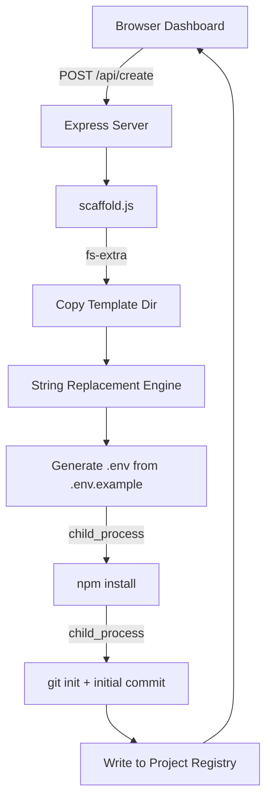

# Case Study: Project Starter
## Eliminating the "Copy-Paste" Project Setup Workflow

> [!NOTE]
> This case study explores the development of **Project Starter**, a local scaffolding dashboard that spins up new client projects from custom templates in seconds — with TinaCMS pre-configured and ready to connect.

---

## 1. Executive Summary
**Project Starter** is a locally-hosted web dashboard built to eliminate the repetitive, error-prone process of setting up new client projects from a template. By combining a visual form interface with a smart scaffold engine, it handles folder copying, global string replacement, `.env` generation, `npm install`, and `git init` — all in one click.

## 2. The Problem: The Copy-Paste Setup Tax

Every new project used to start the same way:

- Open Finder, locate the template folder.
- Duplicate it and rename the folder.
- Manually hunt through `package.json`, config files, and content files to replace the template name strings.
- Copy `.env.example` to `.env` and fill in credentials (then forget a field).
- Run `npm install` in the terminal.
- Remember to `git init` — or forget and start in a messy state.
- Open VS Code, navigate to the project, and finally start building.

This process took **5–15 minutes** per project and introduced small inconsistencies every time — wrong names left in config files, missing `.env` entries, or skipped git setup. A hidden tax paid at the start of every engagement.

## 3. The Solution: A One-Click Scaffold Engine

Project Starter replaces the entire manual flow with a premium local dashboard. Fill in a form, click **Create Project**, and the engine takes care of everything.

| Feature | Description |
| :--- | :--- |
| **Template Library** | Register any local folder as a reusable template. |
| **Smart String Replacement** | Recursively replaces template name strings across all files and filenames. |
| **TinaCMS `.env` Generator** | Reads `.env.example` from the template, injects Tina Cloud credentials if provided, and writes a ready `.env` file. |
| **Auto Slug** | Project slug auto-generates from the name as you type. |
| **Post-Setup Actions** | Runs `npm install` and `git init` automatically. Opens in VS Code or Finder on completion. |
| **Project Registry** | Logs every created project with its path, template, and date for quick re-access. |

## 4. Key Features & Design

### ⚡ Scaffold Engine
The heart of the tool. It performs a **deep recursive copy** of the template directory, skipping noise like `node_modules`, `.git`, and `tina/__generated__`. Every text file is read and passed through the replacement engine — swapping template identifiers for the new project slug in a single pass, including inside filenames themselves.

### 🔑 TinaCMS Ready Out of the Box
The `info-site-template` already handles missing Tina credentials gracefully via its `tina/config.ts`. Project Starter takes this further — during scaffolding, it generates a `.env` with any Tina Cloud credentials provided in the form. If left blank, the project still runs locally without modification. Connecting to Tina Cloud later is as simple as filling in two values.

### ◫ Project Registry
Every scaffolded project is recorded in a local `.project-registry.json`. The **My Projects** tab displays all past projects with quick actions to open in Finder or VS Code — making it easy to jump back into any client site without hunting through the filesystem.

### 🌗 Light / Dark / Auto Theme
The dashboard supports full light mode, dark mode, and auto system preference detection — stored in `localStorage` so the preference persists across sessions.

## 5. Technical Architecture

Project Starter is a lightweight local tool with no cloud dependencies — it runs entirely on your machine.

- **Backend**: Node.js (Express) — REST API for templates, project creation, and opening files.
- **Frontend**: Vanilla HTML, CSS, and JS — no build step, instant load.
- **Scaffold Engine**: `fs-extra` for recursive copy, Node `child_process` for `npm install` / `git init`.
- **Config**: JSON files on disk — portable, version-controllable, no database.

## 6. The Result

Project Starter compresses a 5–15 minute manual setup into a **~2 minute automated flow** (mostly waiting for `npm install`). Every project now starts from a consistent, clean foundation — correct names throughout, a valid `.env`, a git history, and TinaCMS either fully connected or one step from connection.

- **Time saved**: 5–15 minutes per project setup.
- **Consistency**: No more stray template names left in config files.
- **TinaCMS**: Each project is CMS-ready from the first run.
- **Extensible**: New templates can be registered in seconds via the Templates tab.

---

> [!TIP]
> **Pro Tip**: Leave `npm start` running in the background alongside Launch Local. Between the two dashboards, you have a complete local dev command centre — one to scaffold, one to launch.
